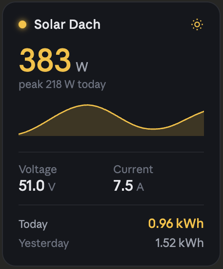

# MPPT Solar Card — Agent Notes

## Project purpose

A Home Assistant Lovelace custom card that visualises the live state of an
**MPPT solar charge controller**. The card replaces the upstream boilerplate
template (`boilerplate-card`) and is published as `custom:mppt-solar-card`.

## What the card displays

The card binds to a set of Home Assistant sensor entities that expose the
controller's telemetry. The intended layout (see design reference below):

| Region          | Content                                            | Source entity (configurable)        |
| --------------- | -------------------------------------------------- | ----------------------------------- |
| Header          | Card title + sun status icon                       | `name` (config) / static icon       |
| Hero value      | Current solar wattage in **W** (large, accented)   | `entity_power` (e.g. `sensor.solar_power`) |
| Sub-hero        | "peak <value> W today"                             | `entity_peak_power_today`           |
| Chart           | Sparkline / area chart of today's power curve      | `entity_power` history              |
| Stats row 1     | **Voltage** (V) · **Current** (A)                  | `entity_voltage`, `entity_current`  |
| Stats row 2     | **Today** kWh (accented) · **Yesterday** kWh       | `entity_energy_today`, `entity_energy_yesterday` |

All values are read from `hass.states[<entity_id>]` and formatted using the
entity's `unit_of_measurement` where possible.

## Design reference



The visual target is a dark, rounded card with an amber/yellow accent for the
sun icon, the headline wattage and the "Today kWh" value. Secondary metrics
(Voltage, Current, Yesterday) use the muted secondary text colour. A filled
area sparkline sits between the hero block and the stats grid, separated by
thin dividers.

## Config field naming convention

When extending `MpptSolarCardConfig` in `src/types.ts`, prefix every entity
binding with `entity_` so YAML stays self-documenting:

```yaml
type: custom:mppt-solar-card
name: Solar Dach
entity_power: sensor.solar_power
entity_peak_power_today: sensor.solar_peak_power_today
entity_voltage: sensor.solar_voltage
entity_current: sensor.solar_current
entity_energy_today: sensor.solar_energy_today
entity_energy_yesterday: sensor.solar_energy_yesterday
```

## Out of scope

- Writing back to the controller (no service calls — read-only card).
- Multi-controller aggregation; one card = one controller.

---

# Development guidelines

The codebase is TypeScript + Lit and builds with Rollup. Use the following as
project-specific guardrails when generating, editing, or reviewing code.

## Quick reference

### Core commands

```bash
pnpm install
pnpm start
pnpm build
pnpm lint
```

### Primary files

- `src/mppt-solar-card.ts` — main card implementation
- `src/editor.ts` — visual editor (`LovelaceCardEditor`)
- `src/types.ts` — card config and type definitions
- `src/action-handler-directive.ts` — tap/hold/double-tap directive
- `src/localize/localize.ts` — localization helper
- `src/localize/languages/en.json` and `src/localize/languages/nb.json` — translation files
- `rollup.config.js` and `rollup.config.dev.js` — production and dev build config

## Architecture and patterns

- The custom element is `custom:mppt-solar-card`.
- Prefer Lit 3 patterns and idiomatic web component structure.
- Keep configuration shape centralized in `src/types.ts`.
- Keep editor schema and defaults aligned with runtime card behavior.
- Keep feature logic in small, readable helpers instead of long monolithic methods.

## TypeScript standards

- Use strict, explicit typing; avoid `any` unless there is no practical alternative.
- Use `import type` for type-only imports where appropriate.
- Validate and narrow optional config fields before use.
- Keep public API names stable unless explicitly requested to change them.

## Lit and component guidance

- Use `@property` for public reactive inputs and `@state` for internal state.
- Avoid direct DOM mutation when Lit reactivity can handle updates.
- Preserve existing card/editor lifecycle behavior.
- For card config, validate early in `setConfig` and throw actionable errors.
- Keep `getCardSize` deterministic and aligned with rendered density.

## Home Assistant integration

- Use Home Assistant helpers and conventions from `custom-card-helpers`.
- Ensure tap, hold, and double-tap actions are wired through existing action patterns.
- Support unavailable/loading/error states gracefully.
- Keep Lovelace config compatibility in mind when changing schema or defaults.

## Localization and copy

- Do not hardcode user-facing strings when a localize key should be used.
- Add new translation keys to both language files currently in the repo (`en.json`, `nb.json`).
- Keep copy concise, sentence case, and user-facing.
- Favor consistent terminology across card UI and editor labels.

## Styling and UX

- Respect Home Assistant theme variables and CSS custom properties.
- Avoid hardcoded colors when theme tokens can be used.
- Keep spacing and typography consistent with existing card styles.
- Ensure layouts work in both compact and wider dashboard widths.

## Build and quality expectations

- Keep `yarn lint` clean for changed code.
- Ensure `yarn build` succeeds after non-trivial changes.
- Do not introduce unrelated refactors in focused changes.
- If updating build tooling, keep dev and prod Rollup configs consistent.

## Safe change workflow

1. Read adjacent code before editing.
2. Implement the smallest viable change.
3. Run relevant checks (`yarn lint`, `yarn build`, or targeted command).
4. Update docs/README when behavior or config changes.
5. Summarize what changed and why.

## Pull request guidance

- Keep PRs focused to one logical change.
- Include screenshots or short clips for visible UI/editor changes.
- Document config changes and migration notes when applicable.
- Call out any follow-up work explicitly instead of bundling extra scope.

## Avoid these common issues

- Breaking editor/card config parity
- Adding untyped dynamic config access
- Hardcoding text instead of localization keys
- Overriding theme behavior with fixed styles
- Changing output filenames or card tag without explicit request